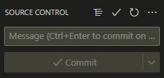

# Introduction 
TODO: Give a short introduction of your project. Let this section explain the objectives or the motivation behind this project. 

# Setting up Github for visual studio Code
this is a guide to set up github for visual studio code.

1.	Make sure you installed Git on your computer, You can check this by opening a new terminal in visual studio code (Ctrl+Shift+`) and typing: "git --version"
if this return something along the lines of: "git version 2.36.0.windows.1" then you have git installed,
however if you recieve something along the lines of: "git : The term 'git' is not recognized as the name of a cmdlet" then you do not have git installed.
You can install git here: https://gitforwindows.org/

2.  open the folder, in visual studio code, in which you want to edit the git repos.

3.	then in the terminal in visual studio code run the line: "git clone https://HU-HBO-ICT@dev.azure.com/HU-HBO-ICT/2022-Open-ICT-Kappersproject%20Squad3/_git/2022-Open-ICT-Kappersproject%20Squad3"

4.	go into File explorer and move the .git folder and any other contents from the /2022-Open-ICT-Kappersproject%20Squad3 folder to the parent folder.

5.	remove the folder 2022-Open-ICT-Kappersproject%20Squad3 if it is empty, and check in in visual studio code if you can commit changes. if this is what you see:  then you probably did it right.

NOTE: if during any step you need to login to github then do that. you can use any github account you like even if it was just created.

# Build and Test
This Project does not build or test yet.

# Contribute
TODO: Explain how other users and developers can contribute to make your code better. 

If you want to learn more about creating good readme files then refer the following [guidelines](https://docs.microsoft.com/en-us/azure/devops/repos/git/create-a-readme?view=azure-devops). You can also seek inspiration from the below readme files:
- [ASP.NET Core](https://github.com/aspnet/Home)
- [Visual Studio Code](https://github.com/Microsoft/vscode)
- [Chakra Core](https://github.com/Microsoft/ChakraCore)
